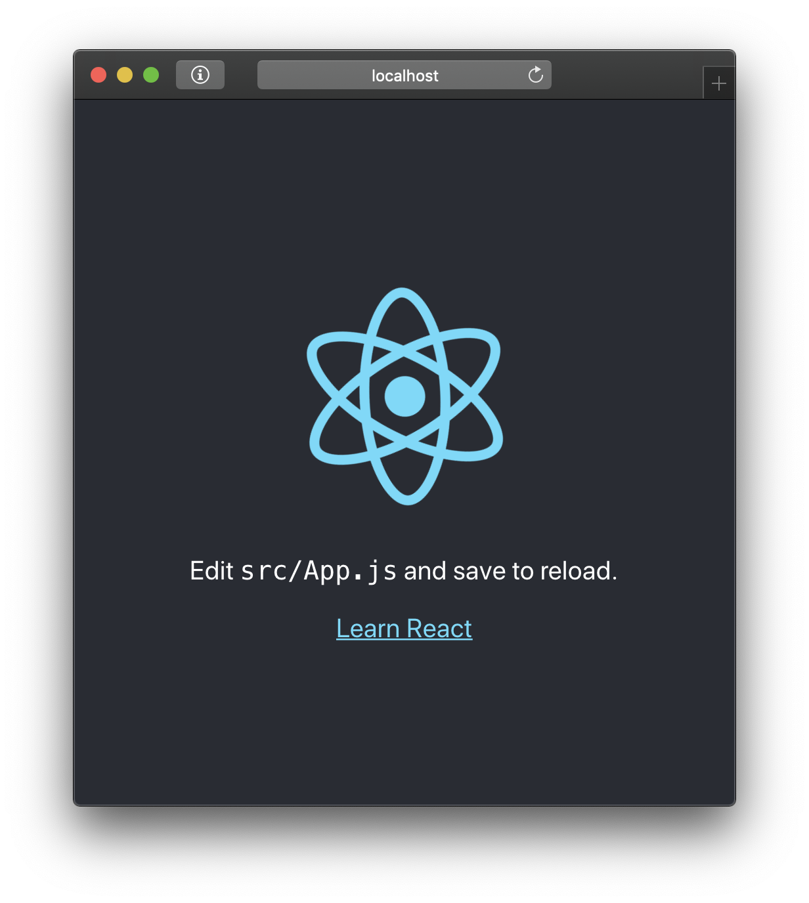

# JS/React frontend

- [JS/React frontend](#jsreact-frontend)
- [Что мы будем создавать](#%d0%a7%d1%82%d0%be-%d0%bc%d1%8b-%d0%b1%d1%83%d0%b4%d0%b5%d0%bc-%d1%81%d0%be%d0%b7%d0%b4%d0%b0%d0%b2%d0%b0%d1%82%d1%8c)
- [Глоссарий](#%d0%93%d0%bb%d0%be%d1%81%d1%81%d0%b0%d1%80%d0%b8%d0%b9)
- [Общие инструкции](#%d0%9e%d0%b1%d1%89%d0%b8%d0%b5-%d0%b8%d0%bd%d1%81%d1%82%d1%80%d1%83%d0%ba%d1%86%d0%b8%d0%b8)
  - [Консоль/Терминал](#%d0%9a%d0%be%d0%bd%d1%81%d0%be%d0%bb%d1%8c%d0%a2%d0%b5%d1%80%d0%bc%d0%b8%d0%bd%d0%b0%d0%bb)
- [Стартовый проект](#%d0%a1%d1%82%d0%b0%d1%80%d1%82%d0%be%d0%b2%d1%8b%d0%b9-%d0%bf%d1%80%d0%be%d0%b5%d0%ba%d1%82)
  - [Создание стартового проекта](#%d0%a1%d0%be%d0%b7%d0%b4%d0%b0%d0%bd%d0%b8%d0%b5-%d1%81%d1%82%d0%b0%d1%80%d1%82%d0%be%d0%b2%d0%be%d0%b3%d0%be-%d0%bf%d1%80%d0%be%d0%b5%d0%ba%d1%82%d0%b0)
  - [Запуск стартового проекта](#%d0%97%d0%b0%d0%bf%d1%83%d1%81%d0%ba-%d1%81%d1%82%d0%b0%d1%80%d1%82%d0%be%d0%b2%d0%be%d0%b3%d0%be-%d0%bf%d1%80%d0%be%d0%b5%d0%ba%d1%82%d0%b0)
  - [Обзор основных файлов](#%d0%9e%d0%b1%d0%b7%d0%be%d1%80-%d0%be%d1%81%d0%bd%d0%be%d0%b2%d0%bd%d1%8b%d1%85-%d1%84%d0%b0%d0%b9%d0%bb%d0%be%d0%b2)
    - [`public/index.html`](#publicindexhtml)
    - [`src/index.js`](#srcindexjs)
    - [`src/App.jsx`](#srcappjsx)
- [Проект: Список покупок](#%d0%9f%d1%80%d0%be%d0%b5%d0%ba%d1%82-%d0%a1%d0%bf%d0%b8%d1%81%d0%be%d0%ba-%d0%bf%d0%be%d0%ba%d1%83%d0%bf%d0%be%d0%ba)

# Что мы будем создавать
Мы будем делать веб-приложение, которое показывает текущую активность фауны в ACNH

# Глоссарий
Эти понятия и названия будут время от времени употребляться в тексте, их необязательно понимать сразу

**Javascript (JS/ЖС)** — Язык программирования

**Node.js** — Интерпретатор JS, то есть программа, которая исполняет код на JS.

**NPM (Node.js Package Manager)** — Пакетный менеджер для Node.js, программа, которая устанавливает опубликованные другими людьми библиотеки (пакеты). Он также помогает запускать приложение

**NPX** — программа, которая скачивает некоторый пакет из NPM и выполняет определенный скрипт из него. Некоторые пакеты (create-react-app, который мы будем использовать) не используются в проекте непосредственно, они нужны для того, чтоб устанавливать другие проекты

**React.js** — програмный комплекс (*фреймворк*) для создания веб-приложений

**JSX** — диалект JS, обеспечивающий простоту написания HTML-компонентов приложения

**Babel** — библиотека для сборки приложения. Он объединяет все JS/JSX файлы в один, который уже исполняется в браузере. 

# Общие инструкции

## Консоль/Терминал
Текст, выделенный вот таким образом: 

    npm start

— это примеры кода или команды, которые нужно набрать в **терминале**

В VSCode терминал можно отобразить (и скрыть тоже) снизу комбинацией `Ctrl + ~`, он во вкладке `Terminal`. Можно также открыть его из меню  `View > Terminal`

У команд бывают **аргументы**. Аргументы пишутся через пробелы после самой команды

Некоторые часто используемые команды:

`cd` — Смена текущей папки. Сокращение от `change directory`. 

`cd ..` — переход на папку выше

# Стартовый проект

## Создание стартового проекта

Для начала запустим VSCode и откроем консоль. Слева от моргающего курсора будет написан путь к текущей папке. 

    C:\Users\lesha\>_ 

Сейчас мы находимся в "домашней" папке нашего аккаунта. Мусорить там плохо, поэтому перейдем на рабочий стол, набрав в консоли

    cd Desktop

и нажав `Enter`: (Это должно сработать даже на русскоязычной Windows, где папка называется "Рабочий стол")

    C:\Users\lesha\>cd Desktop
    C:\Users\lesha\Desktop\>_ 

Мы используем пакет `create-react-app` (далее — `CRA`) для создания базы нашего приложения. Первым аргументом CRA принимает имя папки, которую он создаст и в которой он создаст все файлы, необходимые для работы нашего приложения. 

Наше приложение будет называться `acnh-fauna` [^1]. Создадим его:

    npx create-react-app acnh-fauna

Процесс займет пару минут, можно пока пойти налить чай.

Когда CRA закончил работать, мы можем открыть созданный проект. Выбери в меню `File > Open` папку проекта (acnh-fauna на рабочем столе).

Слева в интерфейсе должно появиться дерево папок. Найди в нем файл `src/App.js` и переименуй в  `App.jsx` (`правая кнопка > Rename`)

## Запуск стартового проекта

Вернемся обратно в консоль. Нам нужно выполнить команду `npm start` для запуска приложения, но для этого нам нужно *быть* в папке приложения. Если мы сейчас в папке рабочего стола, то можно набрать 

    cd acnh-fauna

и нажать `Enter`. Если же мы находися в папке аккаунта (`C:\Users\<username>`), то надо сначала попасть на рабочий стол, как мы это делали выше.

Теперь, в папке проекта, мы можем выполнить

    npm start

Должен открыться браузер. Если то, что ты видишь в браузере, выглядит так, как на картинке, то мои поздравления!



## Обзор основных файлов

Время посмотреть, как работает наше приложения. У нас в проекте достаточно много файлов, но на данный момент нас интересуют всего три:
### `public/index.html`

Это уже большой файл, но по большей части там только  `<!-- комментарии -->`. Редактировать его мы будем нечасто (если вообще будем), но здесь есть одно интересное место. У меня это 31 строка:

    <div id="root"></div>

Держи это место в уме следующие несколько минут

### `src/index.js` 

Сверху мы видим несколько строк с импортами. `import`-синтаксис не свойственен для JS, это инструкции для сборщика, который добавит указанные файлы в результат при сборке приложения. В качестве источника может быть указан пакет NPM (например `react` или `react-dom`) или относительный путь до файла без расширения (`'./App'`)

Далее ниже вот такая конструкция: 

    ReactDOM.render(
      <React.StrictMode>
        <App />
      </React.StrictMode>,
      document.getElementById('root')
    );

Эта конструкция связывает корень нашего приложения (`App.jsx`) и HTML-документ. 
- `document.getElementById('root')` — функция, которая достает из HTML-документа элемент с указанным ID (в данном случае `'root'`). Это тот самый  `<div id="root"></div>` из прошлого пункта

- Этот кусок кода — это тот самый JSX, который используется при создании интерфейса
  ```
  <React.StrictMode>
    <App />
  </React.StrictMode>
  ```

  Это пока выглядит сложным для понимания, но здесь есть компонент `<App/>`, который мы импортировали из `'./App'`. 
  
  `React.StrictMode` - невидимый компонент, который "активирует дополнительные проверки и предупреждения для своих потомков". 

- `ReactDOM.render()` — функция, которая отрисовывает указанный JSX в определенном месте веб-страницы (в данном случае — наш `<div id="root"></div>`)

### `src/App.jsx`

Это "корень" нашего приложения. Здесь ты можешь видеть стандартные для HTML теги `<p>`, `<a>`, `<div>` и другие[^2]. вместе с HTML-тегами можно использовать JSX-теги, которые вставляют в твой документ реактовские компоненты (такие, как сам `<App/>`). Правило простое: если тег начинается со строчной буквы — это HTML-тег, если с заглавной — React-компонент.

**Задание**: Пока же давай экспериментировать. Поменяем текст внутри блока `<p>` на какое-нибудь приветствие. Потом поменяем ссылку и текст в `<a>` на ссылку своего профиля в соцсеточке. Сделав это, нажми `Ctrl+S` для сохранения файла. Страничка в браузере должна перезагрузиться сама (благодаря некоторой *магии*). 


**Если ты закрыла страницу в браузере**, открой консоль в VSCode, там должна быть ссылка на приложение:

```
Compiled successfully!

You can now view acnh-fauna in the browser.

  Local:            http://localhost:3000            <-- вот эта ссылка
  On Your Network:  http://192.168.1.254:3000

Note that the development build is not optimized.
To create a production build, use npm run build.
```

В этой же консоли будут отображаться все ошибки, которые возникнут при сборке приложения

# Проект: Список покупок


[^1]: Вместо `acnh-fauna` можно набрать любое другое доступное имя папки (желательно латинские буквы, цифры, без пробелов). Здесь и далее я буду использовать это имя

[^2]: Одним из главных атрибутов html-тега является `class`. В JSX вместо него используется атрибут `className`. На то есть некоторые исторические и технические причины. `сlass` работать тоже будет, но это ошибка, и консоль браузера тебе об этом скажет:

        Warning: Invalid DOM property `class`. Did you mean `className`?

    К консоли браузера (и вообще, панели разработчика разработки) мы еще вернемся, так как это крайне полезный инструмент.