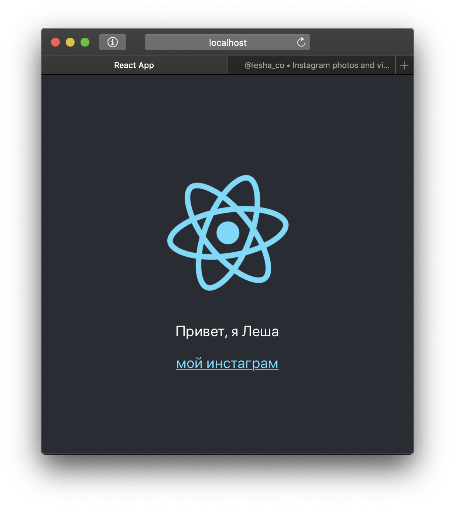

- [Создание нового проекта](#Создание-нового-проекта)
- [Шпаргалка для продолжающих](#Шпаргалка-для-продолжающих)
- [Руководство для начинающих](#Руководство-для-начинающих)
  - [Общие инструкции](#Общие-инструкции)
    - [Консоль/Терминал](#КонсольТерминал)
    - [Навигация по файловой системе из консоли](#Навигация-по-файловой-системе-из-консоли)
  - [Создание стартового проекта](#Создание-стартового-проекта)
  - [Запуск стартового проекта](#Запуск-стартового-проекта)
  - [Обзор основных файлов](#Обзор-основных-файлов)
    - [`public/index.html`](#publicindexhtml)
    - [`src/index.js`](#srcindexjs)
    - [`src/App.jsx`](#srcappjsx)
  - [Очистка заготовки приложения](#Очистка-заготовки-приложения)

# Создание нового проекта

Для начала давай придумаем, как назвать свое новое приложение. Это должа быть цифробуквенная последовательность без пробелов (вместо них используй дефисы или подчеркивания)

Здесь в примере мы будем создавать приложение `hello-world`, так что во всех местах, где ты видишь это название, мысленно заменяй его на своё

# Шпаргалка для продолжающих

Если это твой первый проект, пройди в [Руководство для начинающих](#Руководство-для-начинающих), там подробно описаны все шаги по созданию, а также краткий обзор приложения-заготовки. Если тебе уже все это знакомо, то здесь представлена краткий список шагов по созданию нового приложения.

1. Открой консоль в VSCode и перейди в папку, где ты хочешь создать проект
2. Используй CRA для создания проекта:
    ```
    npx create-react-app hello-world
    ```
3. Перейди в папку только что созданного приложения:
    ```
    cd hello-world
    ```
4. Запусти приложение:
    ```
    npm start
    ```
5. Должен открыться браузер и в консоли фраза "Compiled successfully!"
6. Если потерялась вкладка с приложением, в той же консоли есть ссылка, по которой ты найдешь свое приложение
7. Удали все лишнее из приложения (см. раздел [Очистка заготовки приложения](#Очистка-заготовки-приложения))

# Руководство для начинающих

Подразумевается, что ты пользуешься VSCode в первый раз, поэтому кроме создания самого проекта, я освещу основные моменты этой программы

## Общие инструкции

### Консоль/Терминал
Текст, выделенный вот таким образом: 

    npm start

— это примеры кода или команды, которые нужно набрать в **терминале**. У команд бывают **аргументы**. Аргументы пишутся через пробелы после самой команды.

В VSCode панель с терминалом можно отобразить (и скрыть тоже) комбинацией `Ctrl + ~`, он во вкладке `Terminal`. Можно также открыть его из меню `View > Terminal`. Панель с терминалом можно делать выше или ниже, таская мышкой за верхнюю границу. Я рекомендую держать ее открытой, чтоб там умещалось хотя бы 5-10 строк текста. Так у нас будет возможность сразу видеть все проблемы, которые возникают при сборке.

### Навигация по файловой системе из консоли
Для перехода между папками существует команда `cd` (Сокращение от "**c**hange **d**irectory"). 

Допустим, у нас есть следующее дерево папок:

    C:
    └─ Users
       └─ username
          └─ Desktop
             └─ hello-world

Откроем консоль. Слева от моргающего курсора будет написан путь к текущей папке. 

    C:\Users\username\>_ 

Сейчас мы находимся в "домашней" папке нашего аккаунта. Мусорить там плохо, поэтому перейдем на рабочий стол, набрав в консоли

    cd Desktop

и нажав `Enter`

    C:\Users\username\>cd Desktop
    C:\Users\username\Desktop\>_ 

Это должно сработать даже на русскоязычной Windows, где папка называется "Рабочий стол"[^onedrive]

`cd ..` — выполняет переход на папку выше:

    C:\Users\username\Desktop\>cd ..
    C:\Users\username\>_

В любой момент можно посмотреть, какие файлы присутствуют в текущей папке командой `dir` (Windows) или `ls` (Windows/Linux/OSX)

## Создание стартового проекта
 
Мы используем пакет `create-react-app` (далее — `CRA`) для создания базы нашего приложения. Первым аргументом CRA принимает имя папки, которую он создаст и в которой он создаст все файлы, необходимые для работы нашего приложения. 

```
npx create-react-app hello-world
```

Процесс займет пару минут, можно пока пойти налить чай.

Когда CRA закончил работать, мы можем открыть созданный проект. Выбери в меню `File > Open` папку проекта (hello-world на рабочем столе).

Слева в интерфейсе должно появиться дерево папок. Найди в нем файл `src/App.js` и переименуй в  `App.jsx` (`правая кнопка > Rename`)

## Запуск стартового проекта

Вернемся обратно в консоль. Нам нужно выполнить команду `npm start` для запуска приложения, но для этого нам нужно *быть* в папке приложения. Если мы сейчас в папке рабочего стола, то можно набрать 

    cd hello-world

и нажать `Enter`. Если же мы находися в папке аккаунта (`C:\Users\<username>`), то надо сначала попасть на рабочий стол, как мы это делали выше.

Теперь, в папке проекта, мы можем выполнить

    npm start

Должен открыться браузер. Если то, что ты видишь в браузере, выглядит так, как на картинке, то мои поздравления!


## Обзор основных файлов

Время посмотреть, как работает наше приложение. У нас в проекте достаточно много файлов, но на данный момент нас интересуют всего три:
### `public/index.html`

Это уже большой файл, но по большей части там только  `<!-- комментарии -->`. Редактировать его мы будем нечасто (если вообще будем), но здесь есть одно интересное место. У меня это 31 строка:

    <div id="root"></div>

Держи это место в уме следующие несколько минут

### `src/index.js` 

Сверху мы видим несколько строк с импортами. `import`-синтаксис не свойственен для JS, это инструкции для сборщика, который добавит указанные файлы в результат при сборке приложения. В качестве источника может быть указан пакет NPM (например `react` или `react-dom`) или относительный путь до файла без расширения (`'./App'`)

Далее ниже вот такая конструкция: 

    ReactDOM.render(
      <React.StrictMode>
        <App />
      </React.StrictMode>,
      document.getElementById('root')
    );

Эта конструкция связывает корень нашего приложения (`App.jsx`) и HTML-документ. 
- `document.getElementById('root')` — функция, которая достает из HTML-документа элемент с указанным ID (в данном случае `'root'`). Это тот самый  `<div id="root"></div>` из прошлого пункта

- Этот кусок кода — это тот самый JSX, который используется при создании интерфейса
  ```
  <React.StrictMode>
    <App />
  </React.StrictMode>
  ```

  Это пока выглядит сложным для понимания, но здесь есть компонент `<App/>`, который мы импортировали из `'./App'`. 
  
  `React.StrictMode` - невидимый компонент, который "активирует дополнительные проверки и предупреждения для своих потомков". 

- `ReactDOM.render()` — функция, которая отрисовывает указанный JSX в определенном месте веб-страницы (в данном случае — наш `<div id="root"></div>`)

### `src/App.jsx`

Это "корень" нашего приложения. Здесь ты можешь видеть стандартные для HTML теги `<p>`, `<a>`, `<div>` и другие[^classname]. вместе с HTML-тегами можно использовать JSX-теги, которые вставляют в твой документ реактовские компоненты (такие, как сам `<App/>`). Правило простое: если тег начинается со строчной буквы — это HTML-тег, если с заглавной — React-компонент.

**Задание**: Пока же давай экспериментировать. Поменяем текст внутри блока `<p>` на какое-нибудь приветствие. Потом поменяем ссылку и текст в `<a>` на ссылку своего профиля в соцсеточке. Сделав это, нажми `Ctrl+S` для сохранения файла. Страничка в браузере должна перезагрузиться сама (благодаря некоторой *магии*). 



**Если страница в браузере была закрыта**, открой консоль в VSCode, там должна быть ссылка на приложение:

```
Compiled successfully!

You can now view acnh-fauna in the browser.

  Local:            http://localhost:3000            <-- вот эта ссылка
  On Your Network:  http://192.168.1.254:3000

Note that the development build is not optimized.
To create a production build, use npm run build.
```

В этой же консоли будут отображаться все ошибки, которые возникнут при сборке приложения

## Очистка заготовки приложения

Откроем файл `src/App.jsx` и удалим все внутри `<div className="App">`. Функция App должна принять такой вид:
    
    import React from "react";
    import "./App.css";
    
    function App() {
      return (
        <div className="App">

        </div>
      );
    }

Обрати внимание на удаленный `import logo (...)`. Он нам тоже больше не нужен, так как мы удалили использующий его ``

Откроем `src/App.css` и удалим все его содержимое. Эти стили нужны были для демо-страницы, больше они не пригодятся

В дальнейшем вместо `<div className="App">` я буду писать `div.App`. Это короче, и такой синтаксис используется в CSS[^css-selectors]

(опционально) Из папки `src` можно удалить файлы:
- App.test.js
- logo.svg
- setupTests.js

(опционально) Удали файл `src/serviceWorker.js`, а в файле `src/index.js` удали строчки

    import * as serviceWorker from './serviceWorker';

и

    serviceWorker.unregister();


[^classname]: Одним из главных атрибутов html-тега является `class`. В JSX вместо него используется атрибут `className`. На то есть некоторые исторические и технические причины. `сlass` работать тоже будет, но это ошибка, и консоль браузера тебе об этом скажет:

        Warning: Invalid DOM property `class`. Did you mean `className`?

    К консоли браузера (и вообще, панели разработчика разработки) мы еще вернемся, так как это крайне полезный инструмент.

[^onedrive]: Пользователи OneDrive в Windows могут к своему удивлению обнаружить, что папки "Рабочий стол" ("Desktop") нет в домашней папке. Обычно, она находится внутри папки OneDrive:

        C:\Users\username\> cd OneDrive
        C:\Users\username\OneDrive> cd Desktop
        C:\Users\username\OneDrive\Desktop>_


[^css-selectors]: Памятка по синтаксису CSS:
    | Селектор | Соответствующий элемент |
    | -------- | ----------------------- |
    | .a       | Элемент с классом "а"   |
    | #a       | Элемент с id "а"        |
    | div.a    | `<div class="a">`       |
    | div.a.b  | `<div class="a b">`     |

    У элементов могут присутствовать другие классы, кроме указанных в селекторе: `div.a` так же подойдет и к `<div class="a b">`